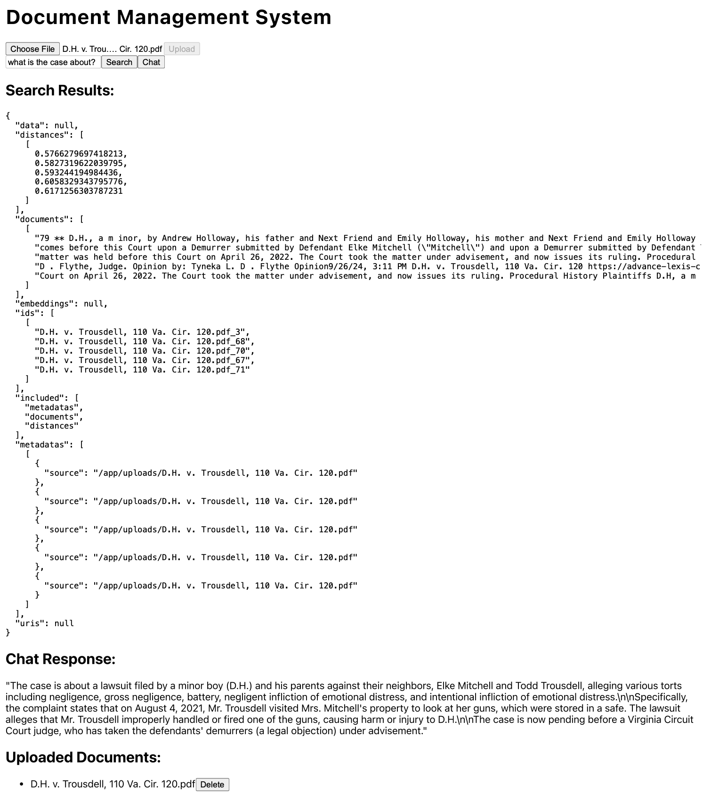

# Study Buddy - Your AI Tutor



This project is in pre-release, we are looking for help on getting this into a first release ready state!

Our plans for this project is to make a fully offline and easily customizable RAG system to aid in research/studying. You control your data. Make use of your hardware.
## Requirements
### Hardware

This was developed on a M1 Macbook Pro with 16gb RAM. Your mileage shouldn't vary much with different hardware as we kept cross-platform support in mind and running ollama is your responsibility. You just need cpu + memory powerful enough to run MiniLM_L6_V2.

### Software

* Ollama (running somewhere you can access)
* Docker
* Pyenv and Poetry
* NodeJS

## Usage

1. Clone this repo with ``git clone https://github.com/mithranm/study-buddy``
2. Rename example.env in /frontend and /backend to .env and set the OLLAMA_HOST to a valid Ollama instance.
3. Run ``docker-compose up --build `` in the project root.
4. Navigate to localhost:9091 in your browser and begin!

## Development

We use Git Flow for development. Switch to the development branch create a feature branch off of it to start developing.

```
git switch develop
git flow feature start feature-name
# After doing your changes, commit
git flow feature finish feature-name
```

Please check if we have any feature branches in the repository already, and refrain from naming your feature that.

### Running While Developing
#### Backend
0. Have python 3.11.10 installed through pyenv
1. Navigate to /backend
2. Run ``poetry install`` 
3. Run ``poetry shell``
4. Run ``python -m src.main``
5. Congrats, the flask server is running on port 9090.

#### Frontend
0. Have NodeJS v20 LTS installed
1. Navigate to /frontend
2. Run ``npm install``
3. Run ``npm start``
4. Congrats, the react app is running on port 9091.

### Unit Testing
#### Backend
1. Navigate to /backend
2. Make sure you have run ``poetry install`` before, run it if not.
3. Run ``poetry run pytest``

#### Frontend
**WIP - We are looking into selenium for testing the frontend (we also need to make a good frontend)**

# Future Updates
* We plan to fully support CUDA once we get our hands on some NVIDIA hardware. This should allow stronger embedding models to be ran.
* We're going to expose the Ollama model choices in the frontend very soon, so you can run a model suitable for your hardware.
* We want to support OpenAI generic apis to avoid reliance on Ollama. Should allow usage of frameworks like vLLM and the OpenAI api itself.
